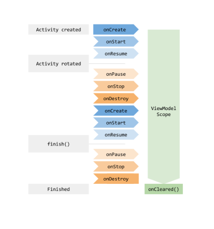

# Unidad 4: Post Basketball Score App (Proyecto que resolví solo):

**Activity Lifecycle** 

Como su nombre lo indica es el ciclo de vida de una Activity. Es un poco mas complejo que el ciclo de vida humano (nacer, crecer, reproducirse y morir) pero al igual que el ultimo sigue una estructura con etapas obligadas (nacer, crecer y morir) y otras optavivas (reproducirse). Es un poco más complejo porque tiene más pasos, incluso algunos se regresan.

Todos los metodos se van llamando automaticamente. Nosotros no tenemos que hacer absolutamente nada. 

¿Cual es la importancia de comprender el Lifecycle de una app? 

En ocasiones, cuando desde una app "x" (ejemplo "Flex App") mandamos abrir otra aplicación, por ej Google Maps, la actividad puedo pasar a distintos momentos de su lifecycle. Por ejemplo: 

1- Llega a "on pause": tiene tres caminos posibles en función de lo que ocurra {
    A- Otras aplicaciones con mayor prioridad necesitan memoría. Por lo que Android va a matar a esta activity pausada.
    B- La actividad está un largo tiempo sin uso. Pasa al metodo "on stop"
    C- El usuario retorna a la activity. Pasa a "on resume"
}
2- Llega a "on stop: tiene tres caminos nuevamente {
    A- Otras aplicaciones con mayor prioridad necesitan memoría. Por lo que Android va a matar a esta activity pausada.
    B- La actividad es finalizada o es destruida por el sistema. Pasa a "on destroy"
    C- El usuario navega hacia la activity nuevamente. Pasa a "on restart"
}

Es importante acá detenerse y entender que en función de cualquiera de los caminos que tenga la activity en su ciclo de vida debemos preveer distintas acciones para manejar nuestros datos. En situaciones deberemos recurrir a una base de datos, en otras deberemos registrar esos datos en nuestra aplicación solamente y con ello será suficiente. 

De aquí la importancía de controlar la aplicación durante todo el ciclo de vida. 

Por ultimo. Cuando paso la aplicación al modo horizontal se producen los siguiente ciclos de la activity en orden: 
stopped -> destroyed -> created -> started -> resumed
Al volver al modo vertical va a pasar nuevamente lo mismo. 

Este ciclo de vida al rotar va a hacer que por ejemplo, el marcador de nuestra app de basketball se pierda frente a la rotación. Por lo que tendremos que aprender a manejar esta situación...

-----------------------------

Para efectos de programación en Android, **una Activity es un View**, pero **no hay que confundirlo con los tipos de views que hemos estado viendo**, que son los botones TextView. Sino más bien es una clase de tipo View, porque es la que se dedica a mostrar la información al usuario.
Pero **las Activities tienen un problema y es que nosotros no tenemos control sobre ellas**. Como te mencioné en las lecciones pasadas, Android puede destruirlas cuando se le dé la gana.
Ya lo vimos que puede suceder tanto cuando abres otra aplicación que necesita recursos como cuando por ejemplo, giras la pantalla, perdemos todos los datos y no hay mucho control o no hay mucho que hacer con eso.

Cuando las apps se vuelven muy grandes, las activities deben dejar de ocuparse del procesamiento y la lógica de nuestra app y deben solo concentrarse en mostrarle la información al usuario y en recibir las interacciones que el mismo haga. 

Cuando eso sucede debemos recurrir a otra clase, auxiliar a las activities, para tales fines que se llama "ViewModel" 

Entonces, en resumen, todo lo que sea de **mostrar datos y reaccionar a la pantalla se va a hacer con la Activity** y todas las variables, todo el procesamiento, **todo lo demás se va a hacer con el ViewModel**.

El ViewModel es una clase que mientras la Activity realiza todo su ciclo de vida (se crea, se pausa, detiene, restablece, muere, etc) sigue vivo en todo el proceso.

Entonces, como vimos en la lección pasada del Basquetball Score, cuando rotamos la Activity, si teníamos los datos almacenados en la misma Activity, estos se perdían.
Pero si los tenemos ahora almcenados en el ViewModel vemos que como el modelo sobrevive a la rotación de la Activity. Esos datos ya no se van a perder.
Y otra gran ventaja que yo veo es que cuando hacemos llamados a Internet, nosotros no sabemos en qué momento va a contestar el servidor. Esto depende mucho de la velocidad del Internet, de cómo esté programado el backend.
Entonces, como no sabemos en qué momento va a llegar... un problema muy recurrente que teníamos antes, cuando no existía esto del ViewModel, es que si esos datos volvían después del "on pause" o del "on stop", la app se rompía porque no tenía forma de mostrarlo, porque la Activity ya estaba destruida. 
Con el ViewModel si esta operación se está haciendo y la Activity manda a llamar Destroy, el modelo automáticamente va a destruir el proceso y no va a tratar de mostrar nada y entonces te ahorras bastantes problemas que teníamos antes como programadores de Android. Y este mismo problema aplicaba tanto para cuando traíamos datos de Internet como cuando los traíamos desde la base de datos.

